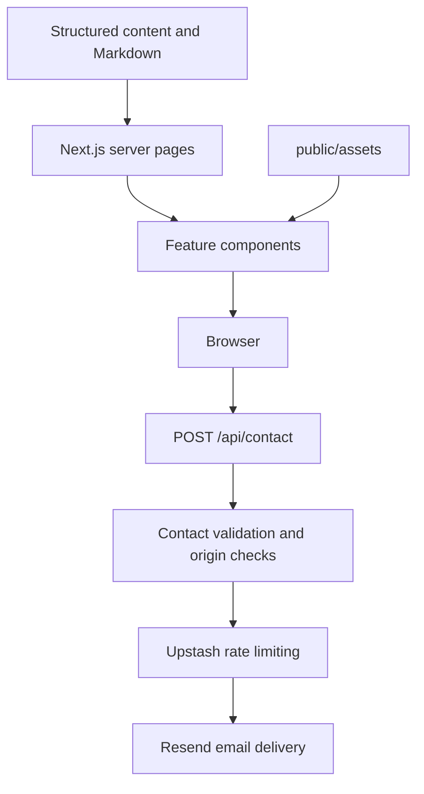

# Architecture

## Structure and responsibilities

This is one Next.js application, with one package manifest and lockfile at the repository root. There is no separate backend server or database of portfolio content.

- **src/app** owns routes and composition. `layout.tsx` provides fonts, themes, navigation, footer, metadata and structured data. Route filenames such as `page.tsx`, `layout.tsx` and `route.ts` retain Next.js conventions.
- **src/components** owns presentation and interaction, grouped into `layout`, `home`, `projects`, `experience`, `honors`, `story`, `vision`, `contact` and `ui`. Page components assemble these features.
- **src/content/data** owns editable structured content. It contains no database calls. Honors own their recognition records independently of experience.
- **src/content/posts** and **src/content/story** own Markdown. `src/lib/content-loader.ts` reads these files on the server, validates publication metadata, and converts Markdown for rendering. Story metadata lives in `src/content/data/story-chapters.ts`.
- **src/lib/contact/validation.mjs** validates and normalizes contact input on the server and in unit tests.
- **public/assets** is the only static-media root. Paths in content start with `/assets/`, never `public/`.
- **src/styles/globals.css** imports feature styles in a deliberate order, keeping responsive overrides after base styles. `base.css` defines theme tokens; `responsive.css` owns shared breakpoints. Keep this order unless intentionally changing the cascade.

## Rendering flow

Most pages are statically generated during build. Dynamic project and chapter routes are generated from local records; `/api/contact` runs on the server when requested. There are no browser-exposed service credentials.

Interactive client components handle the project dialog/gallery, experience expansion, honors stack, story reader settings, theme/navigation, scroll-driven hero and canvas journey. Static project details are separate from the interactive project grid so standalone pages can render them on the server.

The space journey is drawn by `components/vision/draw-space-journey.ts` and orchestrated by `civilization-scene.tsx`. It combines canvas geometry with Earth textures and generated concept artwork. It illustrates a future ambition, not an operating space system.

YouTube embeds load only after interaction. Portraits and galleries use Next Image. Assets use contain-fit where their full composition or screenshot content needs to remain visible.

## Conventions

- Use kebab-case for filenames and folders, PascalCase for React components, and descriptive names for data fields.
- Import internal modules with `@/` (mapped to `src/`); relative imports are suitable within one feature.
- Keep business/personal records in `content/data`, not duplicated across pages.
- Shared reusable UI goes in `components/ui`; keep feature-specific UI inside its feature.
- Do not place private source documents, credentials, full external repositories or raw working media under `public/`.
- Preserve the autobiography verbatim. The unit test compares its reconstructed SHA-256 against the approved manuscript, including the November 2020 Aerospacizm date correction.
- Keep intentional attribution intact; project credits are distinct from portfolio ownership.

## Validation boundaries

Unit tests cover content integrity and contact validation. `check:assets` detects missing references and unreferenced public files. TypeScript and the production build validate module paths and routes. Browser scripts cover desktop/mobile layouts, galleries, navigation, story controls, experience expansion, honors and motion.

Browser checks run sequentially to limit resource use. They do not validate the backend of third-party project deployments or guarantee external YouTube playback. Contact UI checks mock delivery failures; actual email delivery requires separate configuration and an intentional delivery test.
